<p align="center">
  
</p>

<h1 align="center">Cron GUI</h1>

<p align="center">
  <strong>Manage cron jobs from a modern web UI — without touching raw crontab text.</strong>
</p>

<p align="center">
  <a href="https://www.npmjs.com/package/cron-gui"></a>
  <a href="https://github.com/ysskrishna/cron-gui/actions/workflows/ci.yml"></a>
  <a href="https://hub.docker.com/r/ysskrishna/cron-gui"></a>
  <a href="https://nodejs.org/"></a>
  <a href="LICENSE"></a>
</p>

Cron GUI is a drop-in successor to [crontab-ui](https://github.com/alseambusher/crontab-ui) with a rebuilt interface, safer deploy workflow, and dozens of bug fixes. Create, edit, pause, run, back up, and restore jobs from one place — then deploy to the system crontab when you are ready.

<p align="center">
  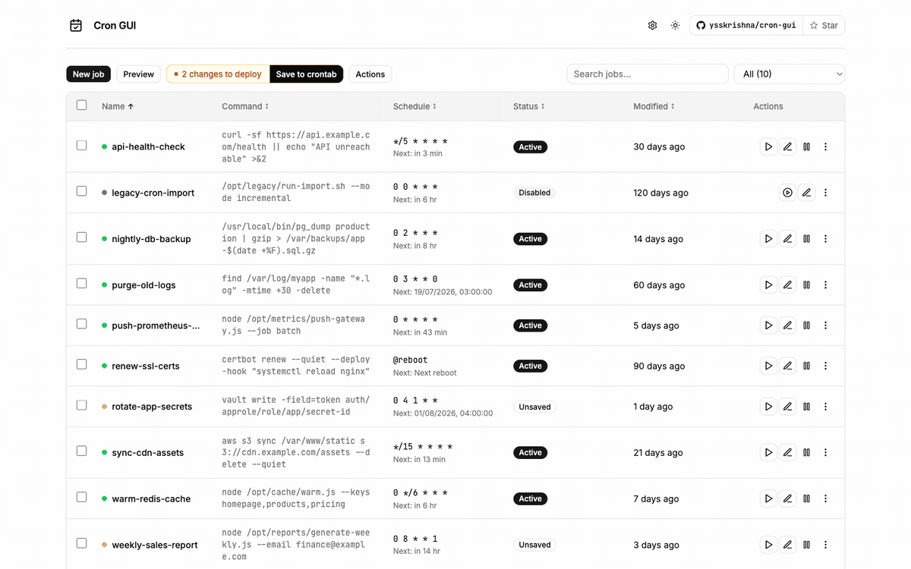
</p>

## Highlights

| | |
|:--|:--|
| **Safe by default** | Edit jobs in the app first. Review changes, preview the crontab text, then deploy with **Save to crontab**. |
| **Built for real servers** | Search, status filters, bulk actions, pagination, and per-job stdout/stderr logs. |
| **Portable** | Export `crontab.db` and move jobs between machines without SSH or copy-paste. |
| **Compatible** | Existing `crontab.db` files from crontab-ui work as-is. |

## Quick start

Requires **Node.js 20+**.

```bash
npm install -g cron-gui
cron-gui
```

Open **http://127.0.0.1:8000**

```bash
# Custom host, port, or data directory
HOST=0.0.0.0 PORT=9000 CRON_DB_PATH=/var/lib/cron-gui cron-gui

# Reset local database and start fresh
cron-gui --reset
```

## See it in action

### Job dashboard

Sortable table with live status, next-run hints, and unsaved-change indicators — so you always know what is scheduled and what still needs deploying.

<p align="center">
  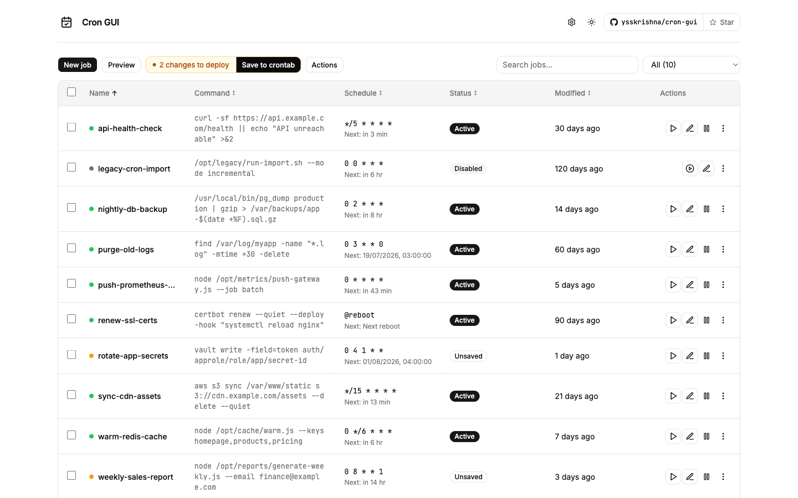
</p>

### Create and edit jobs

Schedule presets, cron expressions, logging, and optional email notifications — all in a focused dialog.

<p align="center">
  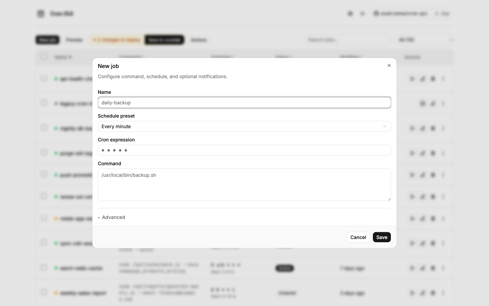
</p>

<p align="center">
  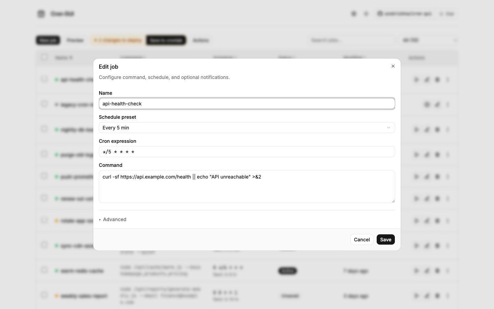
</p>

### Preview before you deploy

See the exact crontab text — environment variables plus one line per enabled job — before writing to the system crontab.

<p align="center">
  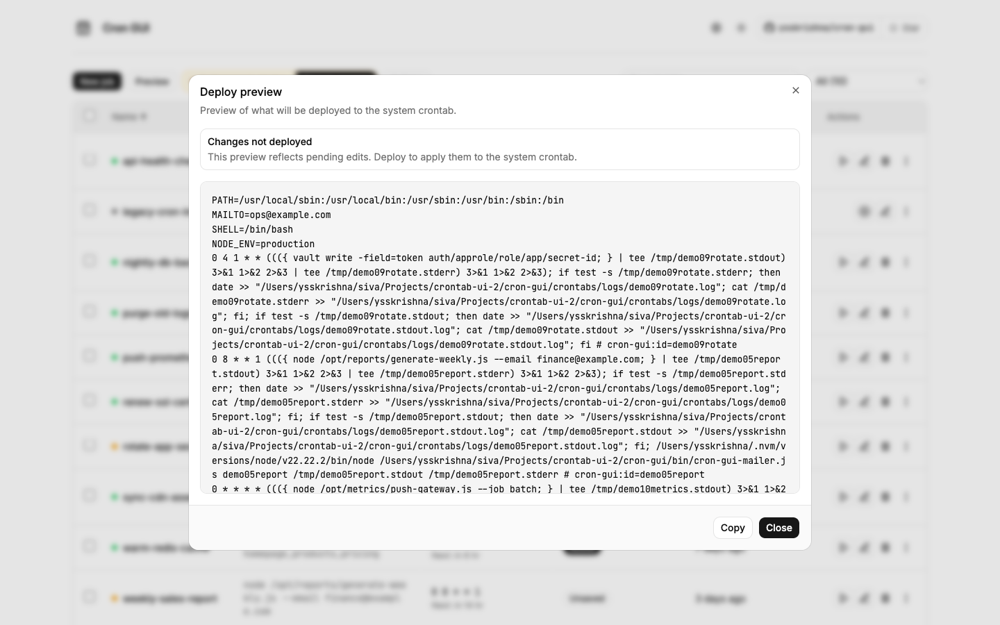
</p>

### Crontab environment

Set `PATH`, `MAILTO`, and other variables once — applied to every deployed job.

<p align="center">
  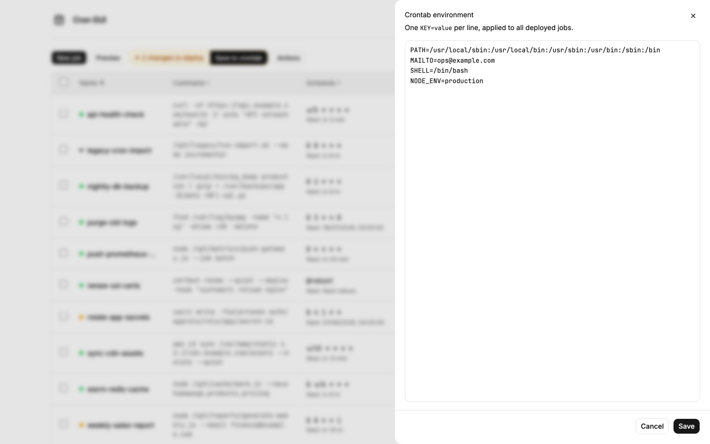
</p>

### Per-job logs

View stdout and stderr history for any job without leaving the page.

<p align="center">
  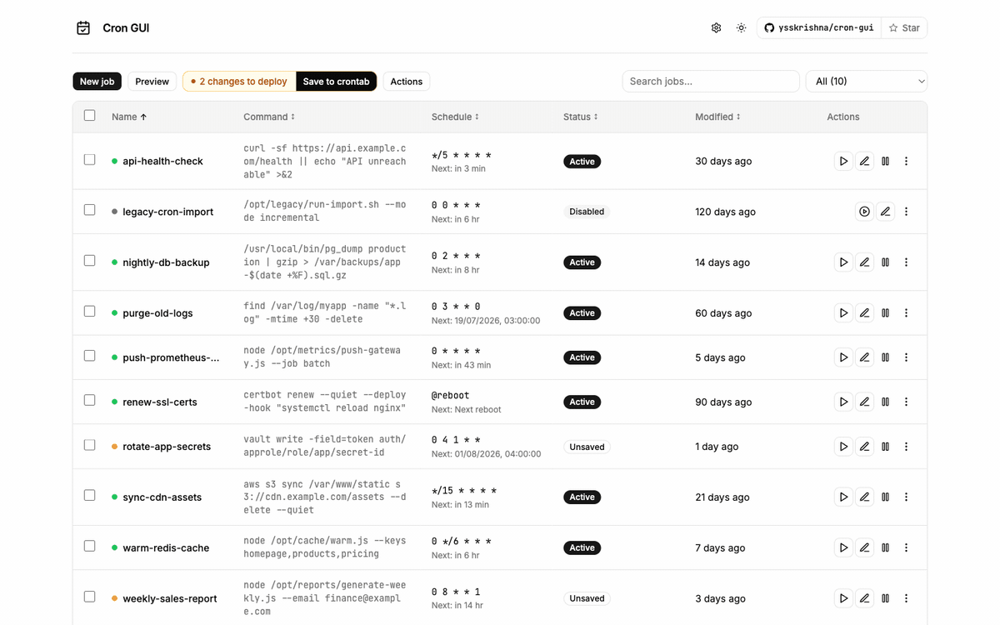
</p>

### Backups and portability

Server-side snapshots, database import/export, and system crontab sync — grouped under **Actions**.

<p align="center">
  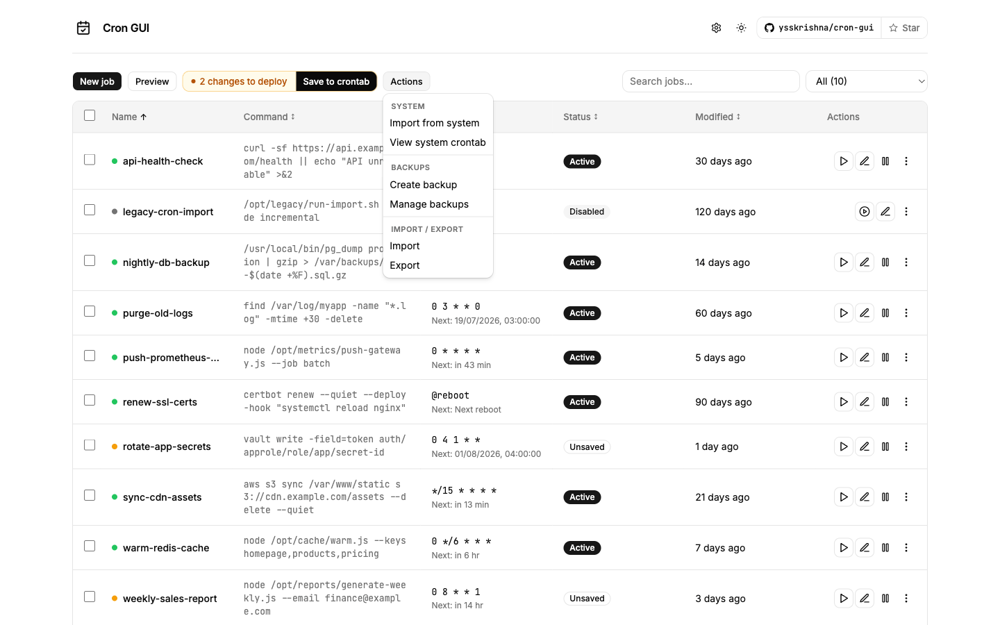
</p>

<p align="center">
  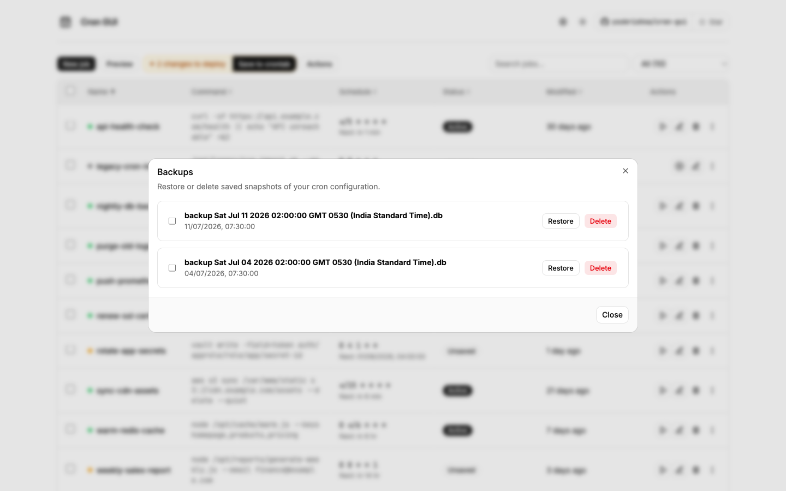
</p>

### Search, filters, and dark mode

Find jobs instantly, filter by status, and switch themes to match your environment.

<p align="center">
  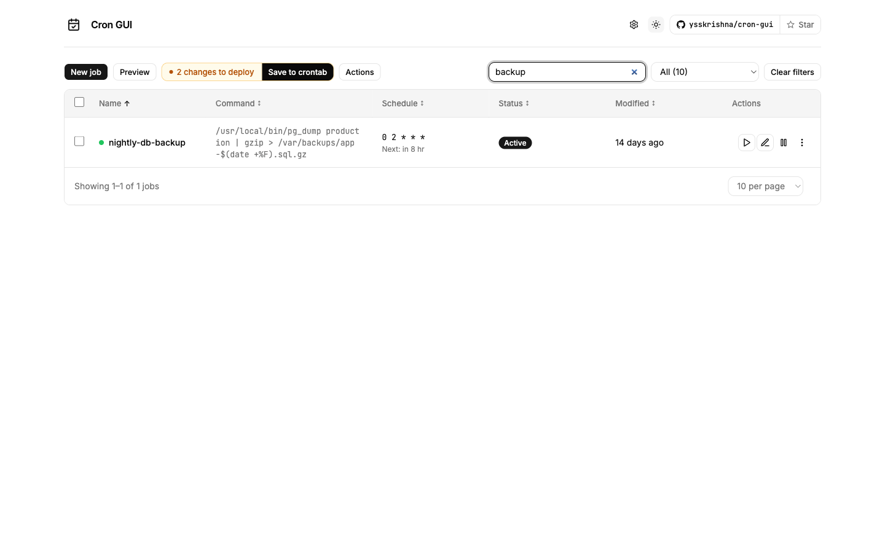
</p>

<p align="center">
  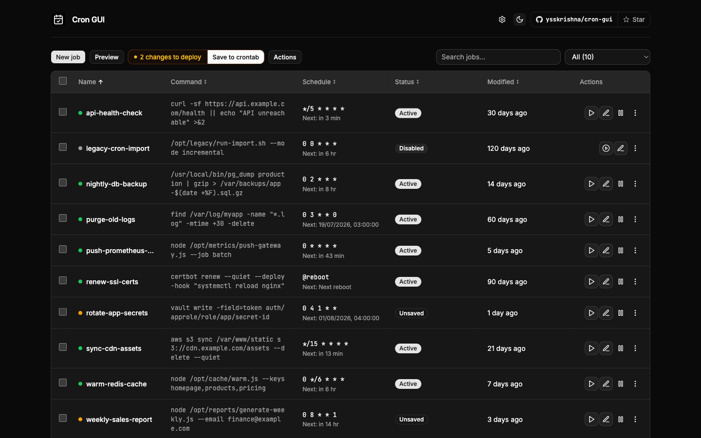
</p>

## Configuration

| Variable | Purpose |
|----------|---------|
| `HOST` | Bind address (default `127.0.0.1`) |
| `PORT` | Port (default `8000`) |
| `BASE_URL` | URL path prefix when behind a reverse proxy |
| `CRON_DB_PATH` | Directory for `crontab.db`, backups, and logs |
| `BASIC_AUTH_USER` / `BASIC_AUTH_PWD` | HTTP basic auth |
| `SSL_CERT` / `SSL_KEY` | HTTPS (both must be set together) |
| `ENABLE_AUTOSAVE` | Auto-deploy on DB changes |

Common flags: `--autosave`, `--reset`

Full reference: [docs/configuration.md](docs/configuration.md)

## Docker

```bash
docker pull ysskrishna/cron-gui:latest
docker run -d -p 8000:8000 ysskrishna/cron-gui:latest
```

With Compose:

```bash
docker compose up -d
```

See [docs/docker.md](docs/docker.md) for volumes, auth, and production notes.

## Migrating from crontab-ui

1. Install `cron-gui` instead of `crontab-ui` — existing `crontab.db` files are compatible.
2. **Schedule presets:** The UI uses 5-field cron expressions plus `@reboot`. Macros like `@hourly` still work in crontab if typed manually.
3. **Deploy workflow:** Changes are staged in the app until you click **Save to crontab** (unless `--autosave` is enabled).

## Resources

- [Configuration and CLI options](docs/configuration.md)
- [Docker deployment guide](docs/docker.md)
- [nginx integration](docs/nginx.md)
- [Troubleshooting notes](docs/issues.md)
- [Release history (CHANGELOG)](CHANGELOG.md)
- [Upstream crontab-ui docs](https://github.com/alseambusher/crontab-ui)

## Support

If you find this project helpful:

- Star the [repository](https://github.com/ysskrishna/cron-gui)
- [Report issues](https://github.com/ysskrishna/cron-gui/issues)
- Submit pull requests
- [Sponsor on GitHub](https://github.com/sponsors/ysskrishna)

## Credits

Forked from [crontab-ui](https://www.npmjs.com/package/crontab-ui) by [alseambusher](https://github.com/alseambusher).

## License

MIT © [Y. Siva Sai Krishna](https://github.com/ysskrishna) — see [LICENSE](LICENSE) for details.

---

<p align="left">
  <a href="https://github.com/ysskrishna">Author's GitHub</a> •
  <a href="https://linkedin.com/in/ysskrishna">Author's LinkedIn</a> •
  <a href="https://ysskrishna.space">Author's site</a> •
  <a href="https://github.com/ysskrishna/cron-gui/issues">Report Issues</a>
</p>
